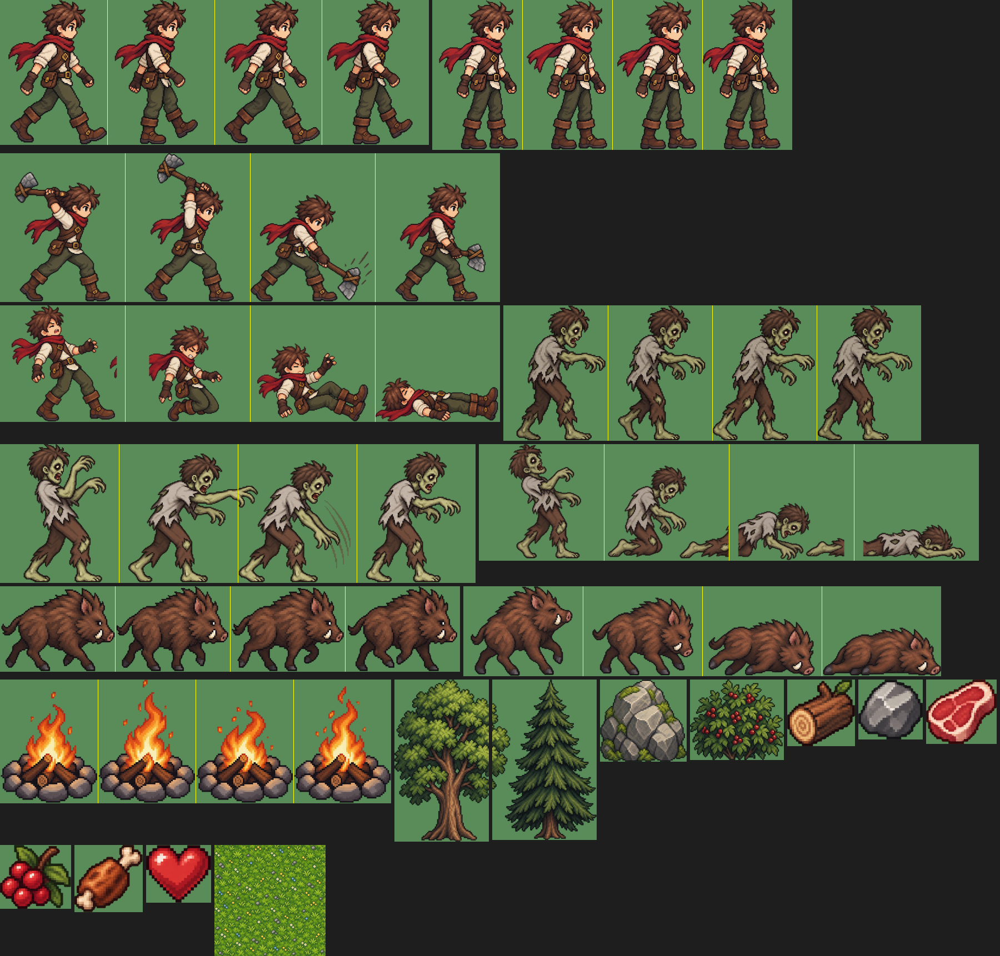

# 🌲 생존의 숲 (Survival Forest)

three.js로 만든 2.5D 생존 게임입니다.
캐릭터, 몬스터, 오브젝트 그래픽은 모두 **Codex CLI의 이미지 생성(GPT image)** 으로 스프라이트 시트를 만들고, 프레임 단위로 잘라 애니메이션으로 재생합니다.



## 🎮 게임 방법

낮에는 나무를 베고 돌을 캐고 멧돼지를 사냥하세요.
해가 지면 추위와 함께 좀비가 몰려옵니다. 모닥불을 피우고 며칠이나 버틸 수 있는지 도전하세요!

| 키 | 동작 |
|---|---|
| `W` `A` `S` `D` / 방향키 | 이동 |
| `Space` / 마우스 클릭 | 공격 · 벌목 · 채굴 |
| `E` | 열매 따기 / 모닥불에 나무 넣기 (+25초) |
| `F` | 먹기 (구운 고기 → 열매 → 생고기 순) |
| `R` | 모닥불 근처에서 생고기 굽기 |
| `C` | 모닥불 제작 (나무 5 + 돌 3) |

### 생존 규칙
- **하루 = 3분.** 체력과 허기를 관리해야 합니다. 허기가 0이 되면 체력이 줄어듭니다.
- **밤**에는 모닥불 곁이 아니면 추위로 체력이 줄어듭니다.
- **좀비**는 밤에만 나타나고, 날이 갈수록 수와 속도가 늘어납니다. 불을 두려워하며 해가 뜨면 사라집니다.
- **멧돼지**를 사냥하면 생고기가 나옵니다. 모닥불에 구우면 회복량이 커집니다.
- 모닥불은 연료가 떨어지면 꺼집니다. 나무를 넣어 유지하세요.

## ▶️ 실행 방법

텍스처를 불러오려면 로컬 웹 서버가 필요합니다. `index.html`을 파일로 바로 열면 동작하지 않습니다. 별도 빌드 과정은 없습니다.

- **Windows:** `start.bat` 더블클릭
- **macOS / Linux:** `./start.sh` 실행 후 http://localhost:8123 접속
- 직접 실행: `python -m http.server 8123`

**GitHub Pages**로도 그대로 배포할 수 있습니다. 저장소 Settings → Pages → Branch `main` / `root`를 선택하세요.

## 📁 폴더 구조

```
├── index.html            # HUD / 화면 구성
├── game.js               # 게임 로직 (three.js, ES module)
├── start.bat / start.sh  # 로컬 서버 실행
├── assets/
│   ├── raw/              # Codex가 생성한 원본 스프라이트 시트
│   └── sprites/          # 프레임 분리된 게임용 이미지 + sprites.json/js
├── tools/
│   ├── gen.sh            # Codex CLI 이미지 생성 래퍼
│   ├── wave1.sh          # 1차 에셋 생성 프롬프트 (주인공 모션, 좀비, 멧돼지, 소품, 아이콘)
│   ├── wave2.sh          # 2차 에셋 생성 프롬프트 (좀비 공격/사망, 멧돼지 사망, 잔디)
│   └── slice.py          # 시트 → 프레임 분리 스크립트
└── docs/                 # README 이미지
```

## 🖼️ 에셋 제작 파이프라인

1. **기준 캐릭터 생성:** Codex로 주인공 이미지 1장을 만들어 `assets/raw/player_ref.png`로 저장합니다.
2. **모션 시트 생성:** 기준 이미지를 참조로 첨부하고, 모션마다 가로 4프레임짜리 시트를 생성합니다.
   ```bash
   bash tools/gen.sh <이름> "<프롬프트>" <참조이미지>
   ```
3. **프레임 분리:** `python tools/slice.py`를 실행하면 다음 작업을 처리합니다.
   - 연결 요소(blob) 기준으로 프레임을 분리합니다. 포즈가 칸 경계를 넘어도 잘리지 않습니다.
   - 슬롯 중심과 발 기준선을 맞춰 프레임 간 흔들림을 없앱니다.
   - 가로 스트립 PNG와 메타데이터(`sprites.json`, `sprites.js`)를 출력합니다.
4. **게임에서 재생:** `THREE.Sprite`의 UV offset을 프레임마다 바꿔 재생합니다. 좌우 반전은 `repeat.x`를 음수로 설정해 처리합니다.

새 모션을 추가하려면 시트를 생성한 뒤 `slice.py`의 `ANIMS`에 등록하고, `game.js`의 `FrameSprite`에 키를 추가하세요.

### 필요 환경 (에셋을 다시 생성할 때만)
- [Codex CLI](https://github.com/openai/codex) (ChatGPT 로그인, `image_generation` 기능)
- Python 3 + `pillow`, `numpy`, `scipy`

## 🛠️ 기술 스택
- [three.js](https://threejs.org/) r170 (CDN importmap)
- 순수 HTML/CSS/JS
